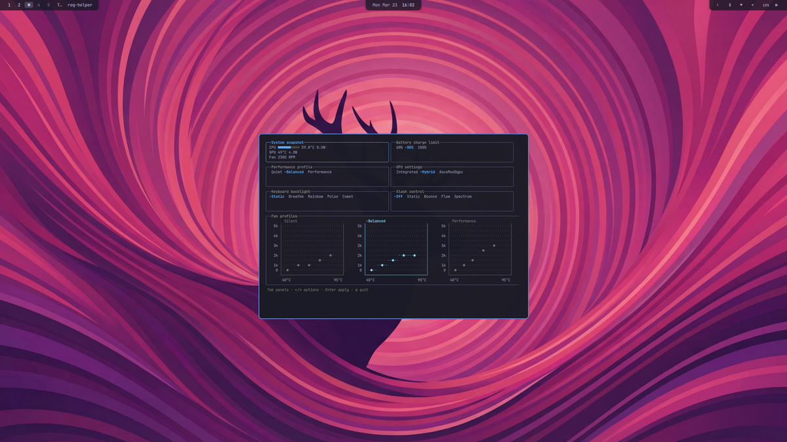

# ROG Helper

A TUI for managing ASUS ROG laptops. Tested on 2025 G14.



## Features

- **System Snapshot**: CPU/GPU temps, power draw, fan RPM
- **Performance Profiles**: Quiet, Balanced, Performance
- **GPU Mode Switching**: Integrated, Hybrid, AsusMuxDgpu
- **Battery Charge Limit**: 60%, 80%, 100%
- **Keyboard Backlight**: Static, Breathe, Rainbow, Pulse, Comet
- **Slash LED Bar**: Off, Static, Bounce, Flow, Spectrum
- **Fan Profiles**: Silent, Balanced, Performance with visual curve charts
- **Power-State Aware**: Different settings for battery vs plugged-in

## Requirements

- Ruby 3.0+
- `asusctl` + `asusd` - ASUS ROG controller daemon
- `supergfxctl` - GPU mode switcher
- ASUS ROG laptop

### Arch Linux

```bash
sudo pacman -S asusctl supergfxctl asusd
sudo systemctl enable --now asusd
```

## Installation

### From AUR

```bash
yay -S rog-helper
```

### From Source

```bash
git clone https://github.com/itsameandrea/rog-helper.git
cd rog-helper
bundle install
sudo rake install
```

## Usage

```bash
rog-helper
```

### Navigation

| Key | Action |
|-----|--------|
| `Tab` / `Shift+Tab` | Cycle through panels |
| `←` / `→` | Select option |
| `Enter` | Apply |
| `q` | Quit |

### Power-State Preferences

The app automatically detects whether you're on battery or plugged in and applies saved preferences for each state:

- **On battery**: Optimized for power saving (e.g., Quiet profile + Integrated GPU)
- **Plugged in**: Optimized for performance (e.g., Performance profile + Hybrid GPU)

Settings persist across reboots. Just configure once for each power state and the app handles switching automatically.

#### What's Saved Per Power State

- Performance profile (Quiet/Balanced/Performance)
- GPU mode (Integrated/Hybrid/AsusMuxDgpu)
- Fan profile preset
- Slash LED mode

## Configuration

`~/.config/rog-helper/preferences.yml`

## Development

```bash
bundle exec rake test    # Run tests
ruby bin/rog-helper      # Run locally
```

## License

MIT

## Acknowledgments

- [asusctl](https://gitlab.com/asus-linux/asusctl)
- [G-Helper](https://github.com/seerge/g-helper)
- [Charm Ruby](https://charm-ruby.dev)